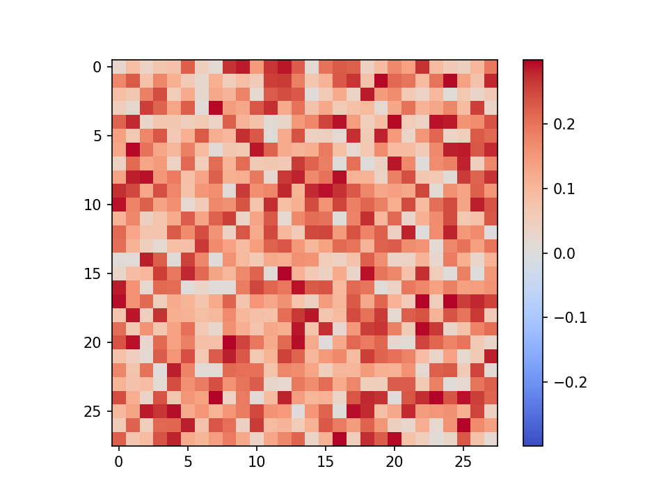
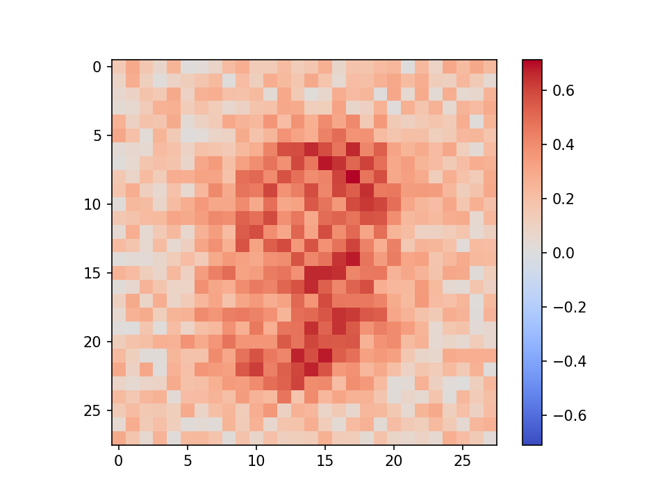

# WrappedBindsNET


(Last update: 2019.10.24)  
  
これはBindsNETと呼ばれるPyTorchベースのSpiking Neural Networksフレームワークをさらに使いやすくしよう，
というコンセプトのもと作成中．  
この小さなライブラリは，全て[snnlib.py](snnlib.py)に詰められていますので，各種定数などはかなり弄りやすいかと思います．  
もちろん，main.pyから直接クラス変数は変更できます．  
完全に個人利用ですが，使いたい人がいればご自由にどうぞ   
(結構頻繁に小さな(大したことない)アップデートをしています．)   
  
I am making a tiny and user friendly library of Spiking Neural Networks with BindsNET.  
All functions are packed to only [snnlib.py](snnlib.py), so you can use easily, maybe.  
This library is completely private myself, but if you want to use it, feel free to use.  
  
**未完成につきバグがまだある可能性があります．(Maybe, there are bugs because this is incompletely.)**   

## 実行保証環境 (Environment)
以下の環境において問題なく実行可能なことを確認しています．  

* OS.........MacOS 10.15 or Ubuntu 16.04 LTS
* Python.....3.6.* or 3.7.*
* BindsNET...0.2.5
* PyTorch....1.10 
  (GPU: torch... 1.3.0+cu92, torchvision... 0.4.1+cu92)

## Example
* Sample code
```python
from snnlib import Spiking


if __name__ == '__main__':

    # Build SNNs and decide the number of input neurons and the simulation time.
    snn = Spiking(input_l=784, obs_time=300)

    # Add a layer and give the num of neurons and the neuron model.
    snn.add_layer(n=100,
                  node=snn.LIF,
                  w=snn.W_SIMPLE_RAND,  # initialize weights
                  scale=0.3,
                  rule=snn.SIMPLE_STDP,  # learning rule
                  nu=(1e-4, 1e-3),  # learning rate
                  )

    # Add an inhibitory layer
    snn.add_inhibit_layer(inh_w=-100)

    # Load dataset
    snn.load_MNIST(batch=1)

    # Check my network architecture
    snn.print_model()

    # Gpu is available?? If available, make it use.
    snn.to_gpu()

    # Plot weight maps before training
    snn.plot(plt_type='wmp', range=5, prefix='pre')

    # Calculate test accuracy before training
    snn.test(1000)

    # Make my network run
    for _ in range(10):
        snn.run(1000)  # run
        snn.test(1000)  # and predict

    # Plot weight maps after training
    snn.plot(plt_type='wmp', range=5, prefix='result')

    # Plot output spike trains after training
    snn.plot(plt_type='sp', range=10)

```

* Generated image samples
    * A weight map of pre-training 
        
        
    * A weight map after STDP training with 1,000 MNIST data
        


## BindsNET references
【docs】  
 [Welcome to BindsNET’s documentation! &mdash; bindsnet 0.2.5 documentation](https://bindsnet-docs.readthedocs.io)  
 
【Github】  
[Hananel-Hazan/bindsnet: Simulation of spiking neural networks (SNNs) using PyTorch.](https://github.com/Hananel-Hazan/bindsnet)  

【Paper】  
[BindsNET: A Machine Learning-Oriented Spiking Neural Networks Library in Python](https://www.frontiersin.org/articles/10.3389/fninf.2018.00089/full)

