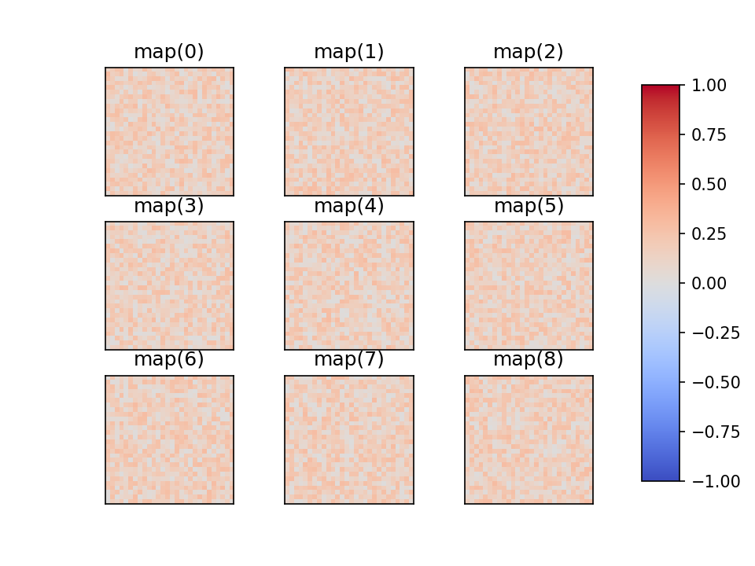
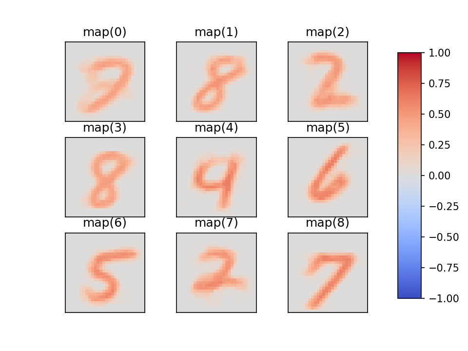
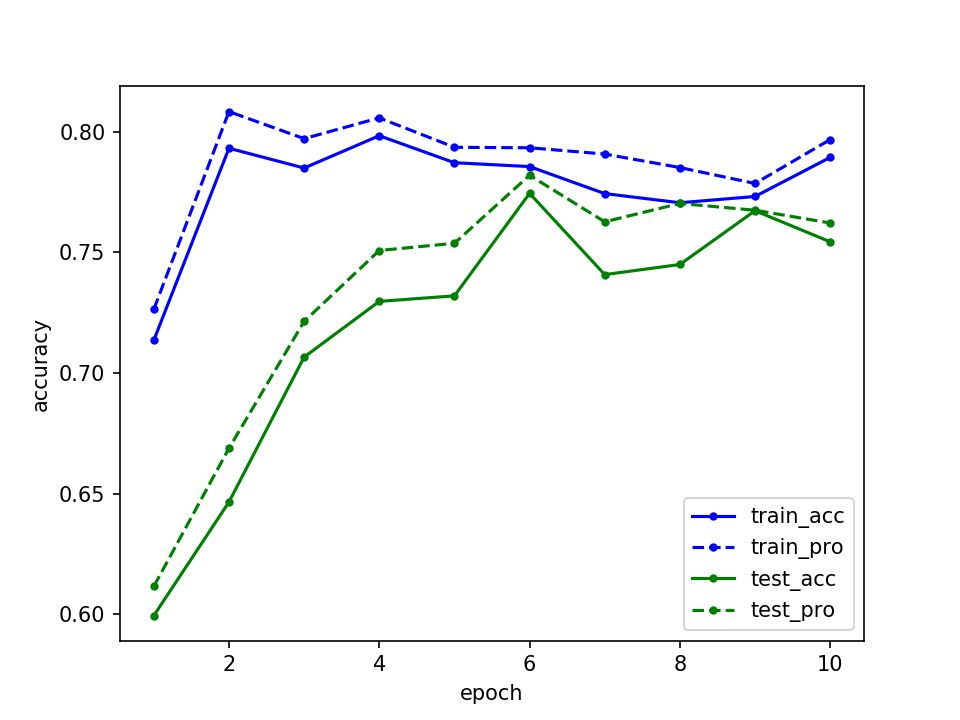

# WrappedBindsNET


これはBindsNETと呼ばれるPyTorchベースのSpiking Neural Networksフレームワークをさらに使いやすくしよう，
というコンセプトのもと作成中．  
この小さなライブラリは，大体[snnlib.py](wbn/snnlib.py)に詰められているので，各種定数などはかなり弄りやすいかと思います．  
もちろん，main.pyから直接クラス変数は変更できます．  
完全に個人利用ですが，使いたい人がいればご自由にどうぞ   
(結構頻繁に小さな(大したことない)アップデートをしています．)   
  
I am making a tiny and user friendly library of Spiking Neural Networks with BindsNET.  
All functions are packed to only [snnlib.py](wbn/snnlib.py), so you can use easily.  
This library is used by private myself, but if you want to use it, feel free to use.  
  
**未完成につきバグがまだある可能性があります．(Maybe, there are bugs because this is incompletely.)**   

## 実行保証環境 (Environment)
以下の環境において問題なく実行可能なことを確認しています．  

* OS.........MacOS 10.15 or Ubuntu 16.04 LTS
* Python.....3.6.* or 3.7.*
* BindsNET...0.2.5
* PyTorch....1.10 
  (GPU: torch... 1.3.0+cu92, torchvision... 0.4.1+cu92)

## Example
* Sample code
```python
from wbn.snnlib import Spiking


if __name__ == '__main__':

    # Build SNNs and decide the number of input neurons and the simulation time.
    snn = Spiking(input_l=784, obs_time=300)

    # Add a layer and give the num of neurons and the neuron model.
    snn.add_layer(n=100,
                  node=snn.LIF,          # or snn.DIEHL_COOK
                  w=snn.W_SIMPLE_RAND,   # initialize weights
                  scale=0.3,             # scale of random intensity
                  rule=snn.SIMPLE_STDP,  # learning rule
                  nu=(1e-4, 1e-3),       # learning rate
                  )

    # Add an inhibitory layer
    snn.add_inhibit_layer(inh_w=-100)

    # Load dataset
    snn.load_MNIST()

    # Check my network architecture
    snn.print_model()

    # If you use a small network, your network computation by GPU may be more slowly than CPU.
    # So you can change directly whether using GPU or not as below.
    snn.gpu = False

    # Gpu is available?? If available, make it use.
    snn.to_gpu()

    # Plot weight maps before training
    snn.plot(plt_type='wmps', prefix='0')

    # Make my network run
    for i in range(10):
        snn.run(tr_size=10000,       # training data size
                unsupervised=True,   # do unsupervised learning?
                alpha=0.8,           # assignment decay
                debug=True,          # Do you wanna watch neuron's assignments?
                # ts_size=5000,        # If you have little time for experiments, be able to reduce test size
                )

        snn.plot(plt_type='wmps', prefix='{}'.format(i+1))  # plot maps

    # Plot test accuracy transition
    snn.plot(plt_type='history', prefix='result')

    # Plot weight maps after training
    snn.plot(plt_type='wmps', prefix='result')

    # Plot output spike trains after training
    snn.plot(plt_type='sp', range=10)

```

or very simply,
```python
from wbn import DiehlCook_unsupervised_model  # packed sample simulation code

DiehlCook_unsupervised_model()
```
is ok (actually this function is my backup data, so it's good for you to use this when you check whether it works properly).

* Generated image samples
    * A weight map of pre-training 
        
        
    * A weight map after STDP training with 1,0000 MNIST data
        
      
    * A Historty example of learning is below (10 epochs).
          


## BindsNET references
【docs】  
 [Welcome to BindsNET’s documentation! &mdash; bindsnet 0.2.5 documentation](https://bindsnet-docs.readthedocs.io)  
 
【Github】  
[Hananel-Hazan/bindsnet: Simulation of spiking neural networks (SNNs) using PyTorch.](https://github.com/Hananel-Hazan/bindsnet)  

【Paper】  
[BindsNET: A Machine Learning-Oriented Spiking Neural Networks Library in Python](https://www.frontiersin.org/articles/10.3389/fninf.2018.00089/full)
  
  
## update list
* 2019.11.22  
    LIF Encoder is added.
    This encoder doesn't use any probability.
    The spike is determined by LIF model using input currents that is normalized each input images.
    Sample image is here([sample](sample_images/encode/lif_encode.png))
     ```python
  from wbn import Spiking
  snn = Spiking(input_l=784, obs_time=300)
  snn.load_MNIST(encoder=snn.LIF_ENCODER, 
                 intensity=5)  # used as maximum current
    ``` 

* 2019.11.20  
    Fixed-frequency encoder is added. 
    This encoder doesn't use any probability.
    The spikes is determined by input values normalized as frequencies in advance. 
    Sample image is here ([sample](sample_images/encode/fixed-frequency_encode.png)).  
    You can call as below.  
    ```python
  from wbn import Spiking
  snn = Spiking(input_l=784, obs_time=300)
  snn.load_MNIST(encoder=snn.FIXED_FREQUENCY, 
                 intensity=128)  # used as maximum frequency
    ``` 
