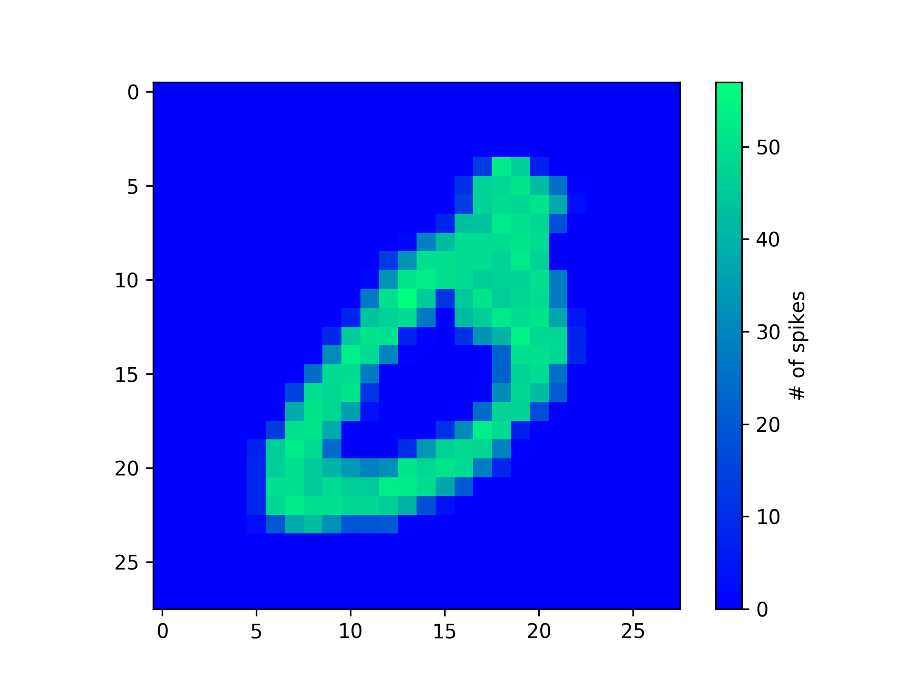
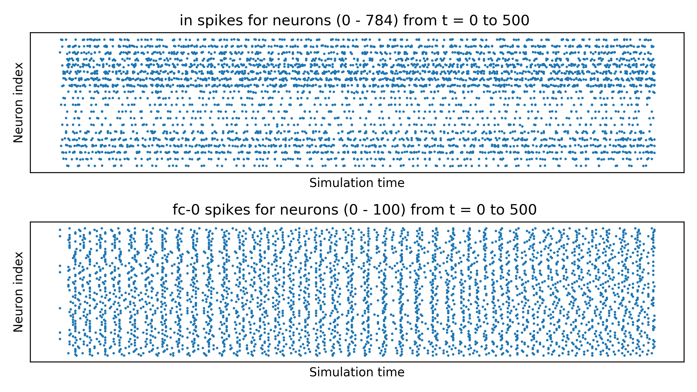

# snnlibpy (仮称)
(Last update: 2019.10.09)  
  
これはBindsNETと呼ばれるPyTorchベースのSpiking Neural Networksフレームワークをさらに使いやすくしよう，
というコンセプトのもと作成．  

完全に個人利用だが，使いたい人がいればご自由にどうぞ．

## BindsNET references
【docs】  
 [Welcome to BindsNET’s documentation! &mdash; bindsnet 0.2.5 documentation](https://bindsnet-docs.readthedocs.io)  
 
【Github】  
[Hananel-Hazan/bindsnet: Simulation of spiking neural networks (SNNs) using PyTorch.](https://github.com/Hananel-Hazan/bindsnet)  

【Paper】  
[BindsNET: A Machine Learning-Oriented Spiking Neural Networks Library in Python](https://www.frontiersin.org/articles/10.3389/fninf.2018.00089/full)

## 現状
* 既存のSTDP学習は簡単できる
* まだGPU対応していない
* コメントやドキュメントが不完全
* コードの最適化が不完全

## Examples

図．MNISTデータセットを定常ポアソン過程によりスパイク列に変換したもの  
　　(最大発火率は100Hzとし300msのスパイク長のとき)
  

図．2層のネットワークの各層各ニューロンの出力スパイク列